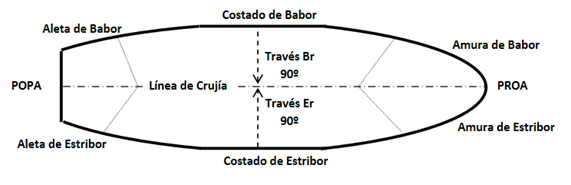

# Nomenclatura

## Denominacions casc

**casco**/**buc**: es el cuerpo de una embarcación, sin contar los elementos móviles como: arboladura, superestructuras, máquinas, pertrechos, etc.

**proa**: es la parte delantera de la embarcación

**popa**: es la parte posterior

**Línea de crujía**: eje longitudinal (popa-proa) de la embarcación

**estribor**: la parte derecha de la embarcación mirando de popa a proa (*la mano de escribor*)

**babor**: la parte izquierda de la embarcación mirando de popa a proa

**costados**: cada una de las partes laterales y exteriores del casco

**bandas**: cada una de las mitades que divide la línea proa-popa (crujía).

**amuras**: partes delanteras de los costados, desde el través convergiendo en la proa.

**aletas**: partes posteriores de los costados, desde través convergiendo en la popa.

**través**: eje perpendicular a la de crujía (cuanod divisamos algo por el través lo veremos a 90º de la línea proa-popa

**línea de flotación**: Es la línea formada por la intersección del agua con el costado. Separa la parte sumergida del casco con la parte del barco que emerge

**obra viva**: es la parte del casco por debajo de la línea de flotación. se pinta con anti-incrustante

**obra muerta**: superficie del casco que se halla por encima de la línea de flotación

**cubierta principal**: es la que cierra el casco por su parte superior, haciéndolo estanco al agua

**cubierta**: cada uno de los pisos de la embarcación

**plan**: supetfície plana más baka del buque

**sentina**: la parte más baja de la embarcación dónde se recogen los posibles derrames de aceite o filtraciones de agua

**imbornales**: orificios que permiten la salida de agua acumulada en cubierta, se deben mantener limpios y libres de obstrucciones

**banyera**: espacio de popa donde normalmente va el timonel

**portillos**: aberturas, generalmente de forma circular, que se practican en los costados de la embarcación o en los mamparos de las superestructuras para dar luz y ventilación

**escotillas**:  aberturas, generalmente rectangulares, practicadas en las cubiertas para establecer comunicación entre los distintos de departamentos de la embarcación

**lumbreras o tragaluz**: aberturas en cubierta para permitir la entrada de luz al interior del barco

**manguerotes**: dispositivos colocados en cubierta orientados al viento para facilitar la ventilación al interior del barco

**pasamanos**: piezas que sirven de asidero al moverse por la embarcación.

**candeleros**: piezas verticales sobre los que se sitúan los pasamanos a los costados de la embarcación

**grifo de fondo**: válvulas fijadas al casco por debajo de la línea de flotación. Se deberían cerrar al navegar con mal tiempo (excepto la refrigeración del motor) y después de atracar. Es conveniente abrir y cerrarlos frecuentemente, se instala un filtro de agua minimo 15cm por encima de la línea de flotación

## Estructura
